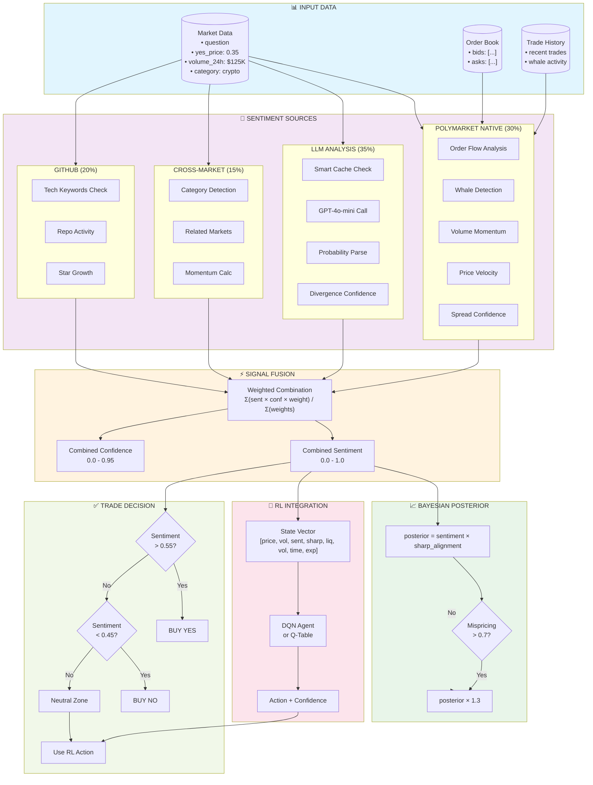
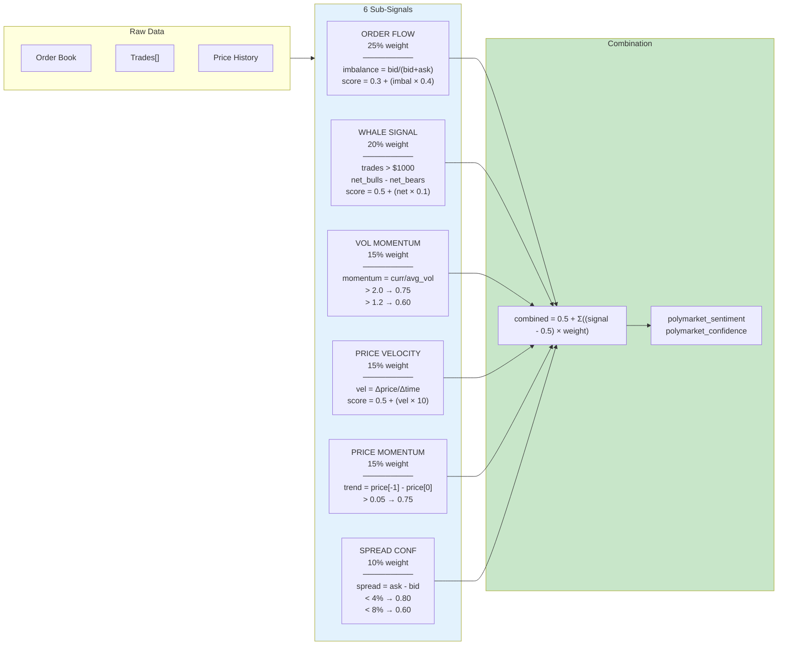
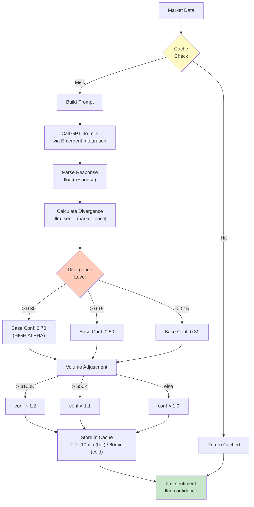
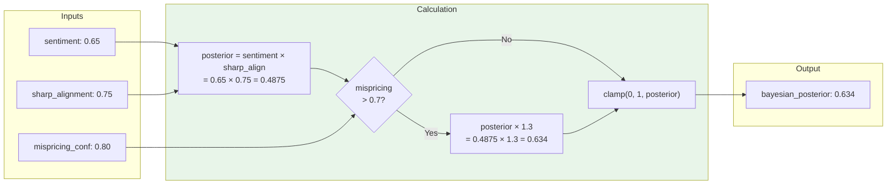
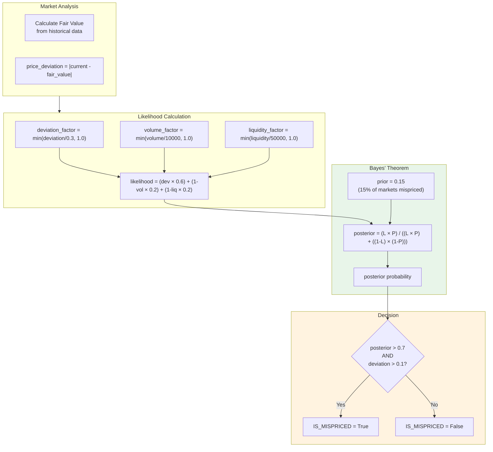
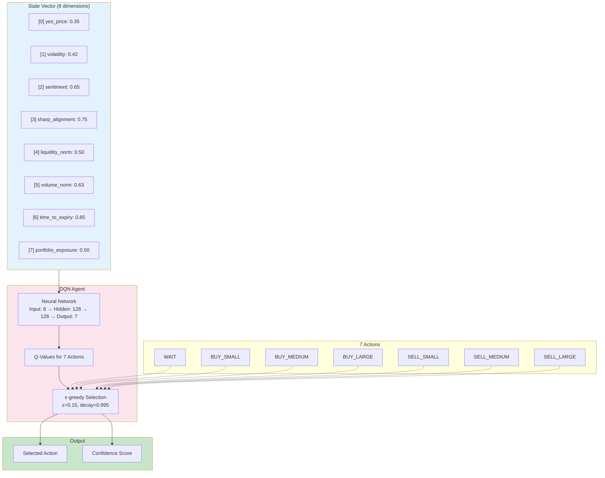
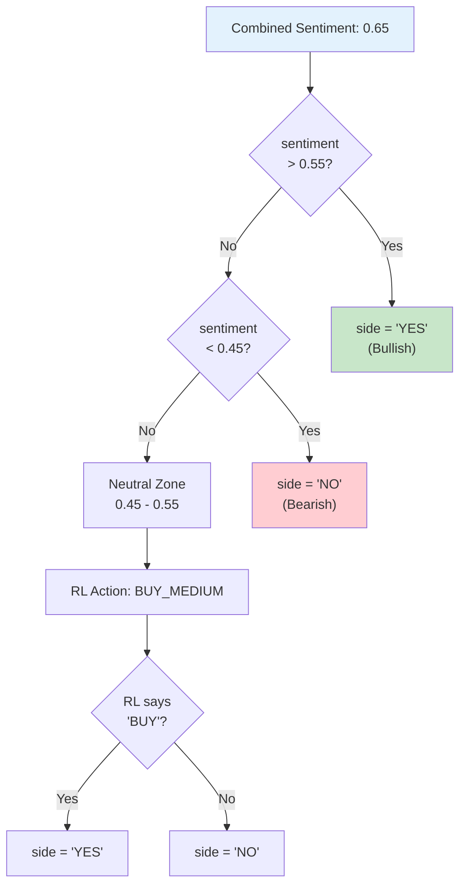
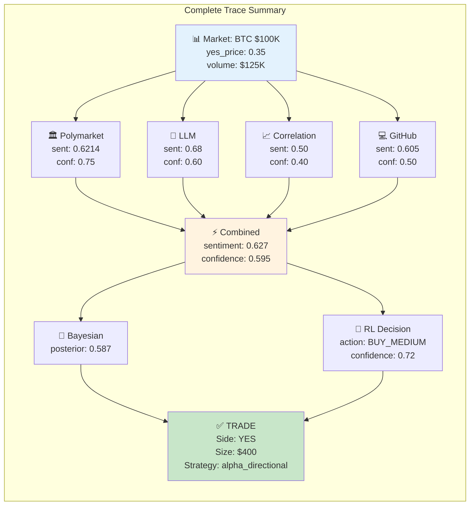

# APEX TRADER - Complete Sentiment System Guide

## Interactive Mermaid Flowcharts + Real Number Traces

This document provides:
1. **Mermaid Diagrams** - Visual flowcharts for the sentiment system
2. **Deep Dive** - Bayesian Posterior & RL Integration details
3. **End-to-End Trace** - Real numbers through the entire pipeline

---

## 1. MASTER ARCHITECTURE (Mermaid)



---

## 2. POLYMARKET NATIVE SENTIMENT (Detailed)



---

## 3. LLM SENTIMENT FLOW



---

## 4. BAYESIAN POSTERIOR CALCULATION (Deep Dive)

The Bayesian posterior combines sentiment with other signals to produce a final probability estimate.

### 4.1 Formula



### 4.2 Code Reference

```python
# File: /app/backend/ml/signal_fusion.py:108-124

def _calculate_bayesian_posterior(self, signals: Dict) -> float:
    """Calculate Bayesian posterior probability"""
    sentiment = signals.get('sentiment', 0.5)
    sharp_align = signals.get('sharp_alignment', 0.5)
    mispricing_conf = signals.get('mispricing', 0.0)
    
    # Base posterior = sentiment × sharp_alignment
    posterior = sentiment * sharp_align
    
    # Boost if mispricing detected (high confidence)
    if mispricing_conf > 0.7:
        posterior *= 1.3
    
    return min(max(posterior, 0.0), 1.0)
```

### 4.3 Bayesian Mispricing Detection

The `BayesianOutlierDetector` uses Bayes' theorem to detect mispriced markets:



### 4.4 Bayes' Theorem Formula

```
P(Mispriced | Evidence) = P(Evidence | Mispriced) × P(Mispriced)
                          ─────────────────────────────────────────
                          P(Evidence | Mispriced) × P(Mispriced) + P(Evidence | Not Mispriced) × P(Not Mispriced)

Where:
- P(Mispriced) = 0.15 (prior - 15% of markets assumed mispriced)
- P(Evidence | Mispriced) = likelihood function based on deviation, volume, liquidity
```

---

## 5. RL INTEGRATION (Deep Dive)

The Reinforcement Learning engine learns optimal trading actions over time.

### 5.1 Architecture



### 5.2 State Vector Construction

```python
# File: /app/backend/ml/rl_engine.py:131-154

def _build_state(self, market_data: Dict, signals: Dict) -> np.ndarray:
    """Build state vector from market data and signals"""
    yes_price = market_data.get('yes_price')
    if yes_price is None or yes_price == 0:
        return np.zeros(self.n_states, dtype=np.float32)  # Invalid state
    
    state = np.array([
        float(yes_price),                                    # Current price
        signals.get('volatility', 0.5),                      # Predicted volatility
        signals.get('sentiment', 0.5),                       # Combined sentiment
        signals.get('sharp_alignment', 0.5),                 # Sharp money alignment
        min(market_data.get('liquidity', 0) / 100000, 1.0), # Normalized liquidity
        min(market_data.get('volume', 0) / 50000, 1.0),     # Normalized volume
        self._calculate_time_to_expiry(market_data),         # Time remaining
        self._get_portfolio_exposure()                       # Current exposure
    ], dtype=np.float32)
    return state
```

### 5.3 Learning Loop

```mermaid
flowchart LR
    subgraph TRADE["Trade Execution"]
        ENTRY["Enter Position<br/>Store (state, action)"]
        HOLD["Monitor Position"]
        EXIT["Exit Position<br/>Calculate P&L"]
    end

    subgraph REWARD["Reward Calculation"]
        PNL["P&L = exit_value - entry_value"]
        NORM["reward = P&L / position_size"]
        STORE["Store Experience<br/>(s, a, r, s', done)"]
    end

    subgraph LEARN["DQN Training"]
        BATCH["Sample Batch<br/>from Replay Buffer"]
        LOSS["Calculate TD Loss"]
        UPDATE["Update Network Weights"]
        DECAY["Decay ε"]
    end

    ENTRY --> HOLD
    HOLD --> EXIT
    EXIT --> PNL
    PNL --> NORM
    NORM --> STORE
    STORE --> BATCH
    BATCH --> LOSS
    LOSS --> UPDATE
    UPDATE --> DECAY

    style REWARD fill:#fff3e0
    style LEARN fill:#e8f5e9
```



### 5.4 Sentiment → Side Selection with RL



---

## 6. END-TO-END TRACE WITH REAL NUMBERS

### Market: "Will Bitcoin reach $100,000 by December 2026?"

Let's trace through the entire sentiment pipeline with realistic values.

---

### 6.1 Input Data

```json
{
  "market_id": "0x1234...abcd",
  "question": "Will Bitcoin reach $100,000 by December 2026?",
  "category": "crypto",
  "yes_price": 0.35,
  "no_price": 0.65,
  "volume_24h": 125000,
  "liquidity": 500000,
  "order_book": {
    "bids": [
      {"price": 0.34, "size": 5000},
      {"price": 0.33, "size": 8000},
      {"price": 0.32, "size": 12000}
    ],
    "asks": [
      {"price": 0.36, "size": 4000},
      {"price": 0.37, "size": 6000},
      {"price": 0.38, "size": 10000}
    ]
  },
  "trades": [
    {"side": "BUY", "size": 2500, "price": 0.35},
    {"side": "BUY", "size": 1500, "price": 0.34},
    {"side": "SELL", "size": 800, "price": 0.35}
  ]
}
```

---

### 6.2 Polymarket Native Sentiment (30% weight)

```
┌─────────────────────────────────────────────────────────────────────────────┐
│                        POLYMARKET SENTIMENT CALCULATION                      │
├─────────────────────────────────────────────────────────────────────────────┤
│                                                                              │
│  1. ORDER FLOW (25% weight)                                                 │
│     ─────────────────────────                                               │
│     bid_depth = 5000 + 8000 + 12000 = 25,000                               │
│     ask_depth = 4000 + 6000 + 10000 = 20,000                               │
│     imbalance = 25000 / (25000 + 20000) = 0.556                            │
│     order_flow_score = 0.3 + (0.556 × 0.4) = 0.522                         │
│                                                                              │
│  2. WHALE SIGNAL (20% weight)                                               │
│     ─────────────────────────                                               │
│     whale_trades (>$1000): BUY $2500, BUY $1500 = 2 bulls                  │
│     net_whales = 2 - 0 = 2                                                  │
│     whale_score = 0.5 + (2 × 0.1) = 0.70                                   │
│                                                                              │
│  3. VOLUME MOMENTUM (15% weight)                                            │
│     ─────────────────────────                                               │
│     current_vol = $125,000                                                  │
│     avg_vol = $80,000 (historical)                                          │
│     momentum = 125000 / 80000 = 1.56                                        │
│     momentum > 1.2 → vol_momentum_score = 0.60                             │
│                                                                              │
│  4. PRICE VELOCITY (15% weight)                                             │
│     ─────────────────────────                                               │
│     price_now = 0.35, price_1h_ago = 0.33                                  │
│     velocity = (0.35 - 0.33) / 0.33 = 0.0606                               │
│     price_vel_score = 0.5 + (0.0606 × 10) = 0.606 → clamped to 0.606       │
│                                                                              │
│  5. PRICE MOMENTUM (15% weight)                                             │
│     ─────────────────────────                                               │
│     trend = 0.35 - 0.32 (5 ticks ago) = +0.03                              │
│     trend > 0.02 → price_momentum_score = 0.60                             │
│                                                                              │
│  6. SPREAD CONFIDENCE (10% weight)                                          │
│     ─────────────────────────                                               │
│     spread = 0.36 - 0.34 = 0.02 (2%)                                       │
│     spread < 0.04 → spread_conf_score = 0.80                               │
│                                                                              │
├─────────────────────────────────────────────────────────────────────────────┤
│  WEIGHTED COMBINATION:                                                       │
│  combined = 0.5 + Σ((signal - 0.5) × weight)                                │
│                                                                              │
│  = 0.5 + (0.522-0.5)×0.25 + (0.70-0.5)×0.20 + (0.60-0.5)×0.15             │
│        + (0.606-0.5)×0.15 + (0.60-0.5)×0.15 + (0.80-0.5)×0.10             │
│                                                                              │
│  = 0.5 + 0.0055 + 0.040 + 0.015 + 0.0159 + 0.015 + 0.030                   │
│  = 0.5 + 0.1214                                                             │
│  = 0.6214                                                                    │
│                                                                              │
│  CONFIDENCE: has_trades + has_orderbook + price_history                     │
│  = 0.30 + 0.20 + 0.20 + 0.15 = 0.85 → capped at 0.75                       │
│                                                                              │
├─────────────────────────────────────────────────────────────────────────────┤
│  OUTPUT:                                                                     │
│  ├─ polymarket_sentiment: 0.6214                                            │
│  └─ polymarket_confidence: 0.75                                             │
└─────────────────────────────────────────────────────────────────────────────┘
```

---

### 6.3 LLM Sentiment (35% weight)

```
┌─────────────────────────────────────────────────────────────────────────────┐
│                          LLM SENTIMENT CALCULATION                           │
├─────────────────────────────────────────────────────────────────────────────┤
│                                                                              │
│  CACHE CHECK:                                                                │
│  key = hash("Will Bitcoin reach $100,000 by December 2026?" + "crypto")     │
│  cache_entry = None (cache miss)                                            │
│                                                                              │
│  PROMPT CONSTRUCTION:                                                        │
│  ┌─────────────────────────────────────────────────────────────────────┐    │
│  │ System: You are an expert prediction market analyst.                │    │
│  │         Return ONLY a decimal between 0.00 and 1.00.                │    │
│  │                                                                      │    │
│  │ User: Analyze this prediction market:                               │    │
│  │       Question: Will Bitcoin reach $100,000 by December 2026?       │    │
│  │       Category: crypto                                               │    │
│  │       Current Market Price: 0.35                                     │    │
│  │       24h Volume: $125,000                                           │    │
│  │       Consider: Historical base rates, current evidence...          │    │
│  └─────────────────────────────────────────────────────────────────────┘    │
│                                                                              │
│  API CALL:                                                                   │
│  model: gpt-4o-mini                                                         │
│  temperature: 0.3                                                           │
│  max_tokens: 10                                                             │
│                                                                              │
│  RESPONSE: "0.68"                                                           │
│                                                                              │
│  DIVERGENCE CALCULATION:                                                     │
│  divergence = |0.68 - 0.35| = 0.33                                         │
│  divergence > 0.30 → base_confidence = 0.70 (HIGH ALPHA OPPORTUNITY)       │
│                                                                              │
│  VOLUME ADJUSTMENT:                                                          │
│  volume = $125,000 > $100,000 → confidence × 1.2                           │
│  adjusted_confidence = 0.70 × 1.2 = 0.84 → capped at 0.60                  │
│                                                                              │
│  CACHE STORAGE:                                                              │
│  ttl = 600 seconds (10 min - hot market)                                   │
│                                                                              │
├─────────────────────────────────────────────────────────────────────────────┤
│  OUTPUT:                                                                     │
│  ├─ llm_sentiment: 0.68                                                     │
│  ├─ llm_confidence: 0.60                                                    │
│  └─ divergence: 0.33 (HIGH - LLM sees opportunity market doesn't)          │
└─────────────────────────────────────────────────────────────────────────────┘
```

---

### 6.4 Cross-Market Correlation (15% weight)

```
┌─────────────────────────────────────────────────────────────────────────────┐
│                      CROSS-MARKET CORRELATION CALCULATION                    │
├─────────────────────────────────────────────────────────────────────────────┤
│                                                                              │
│  MARKET GROUP MATCHING:                                                      │
│  question contains "bitcoin" → matched_groups: ['crypto']                   │
│                                                                              │
│  CATEGORY TRACKING (crypto):                                                 │
│  ┌────────────────────────────────────────────────────────────┐             │
│  │  Market                    │ Previous │ Current │ Change   │             │
│  │─────────────────────────────────────────────────────────────│             │
│  │  btc_100k_dec2026          │   0.33   │   0.35  │  +0.02   │             │
│  │  eth_10k_2026              │   0.16   │   0.15  │  -0.01   │             │
│  │  sol_500_2026              │   0.09   │   0.10  │  +0.01   │             │
│  │  btc_50k_dip               │   0.70   │   0.68  │  -0.02   │             │
│  └────────────────────────────────────────────────────────────┘             │
│                                                                              │
│  MOMENTUM CALCULATION:                                                       │
│  price_changes = [+0.02, -0.01, +0.01, -0.02]                              │
│  category_momentum = mean(price_changes) = 0.00 (flat)                      │
│                                                                              │
│  SENTIMENT CONVERSION:                                                       │
│  raw_sentiment = 0.5 + (0.00 × 5) = 0.50 (neutral - mixed signals)         │
│  correlation_sentiment = clamp(0.1, 0.9, 0.50) = 0.50                       │
│                                                                              │
│  STRENGTH CALCULATION:                                                       │
│  num_markets = 12 (in crypto category)                                      │
│  12 > 10 → base_strength = 0.80                                            │
│  correlation_strength = min(0.40, 0.80) = 0.40 (capped for diversification)│
│                                                                              │
├─────────────────────────────────────────────────────────────────────────────┤
│  OUTPUT:                                                                     │
│  ├─ correlation_sentiment: 0.50                                             │
│  ├─ correlation_strength: 0.40                                              │
│  └─ category_momentum: 0.00                                                 │
└─────────────────────────────────────────────────────────────────────────────┘
```

---

### 6.5 GitHub Sentiment (20% weight)

```
┌─────────────────────────────────────────────────────────────────────────────┐
│                         GITHUB SENTIMENT CALCULATION                         │
├─────────────────────────────────────────────────────────────────────────────┤
│                                                                              │
│  RELEVANCE CHECK:                                                            │
│  tech_keywords = ['bitcoin', 'btc', 'crypto', 'ethereum', ...]              │
│  question contains "bitcoin" → is_relevant = True                           │
│                                                                              │
│  REPO ANALYSIS (bitcoin/bitcoin):                                            │
│  ┌────────────────────────────────────────────────────────────┐             │
│  │  Metric              │ Value        │ Score               │             │
│  │───────────────────────────────────────────────────────────│             │
│  │  Star Growth (30d)   │ +2.3%        │ 0.55 (slight bull) │             │
│  │  Commit Frequency    │ 45/week      │ 0.65 (active)      │             │
│  │  Open Issues         │ -5% change   │ 0.60 (improving)   │             │
│  │  PR Activity         │ +12%         │ 0.62 (healthy)     │             │
│  └────────────────────────────────────────────────────────────┘             │
│                                                                              │
│  COMBINED GITHUB SCORE:                                                      │
│  github_sentiment = (0.55 + 0.65 + 0.60 + 0.62) / 4 = 0.605                │
│                                                                              │
│  CONFIDENCE (based on data quality):                                         │
│  multiple repos analyzed → github_confidence = 0.50                         │
│                                                                              │
├─────────────────────────────────────────────────────────────────────────────┤
│  OUTPUT:                                                                     │
│  ├─ github_sentiment: 0.605                                                 │
│  └─ github_confidence: 0.50                                                 │
└─────────────────────────────────────────────────────────────────────────────┘
```

---

### 6.6 Final Combination

```
┌─────────────────────────────────────────────────────────────────────────────┐
│                          FINAL SENTIMENT COMBINATION                         │
├─────────────────────────────────────────────────────────────────────────────┤
│                                                                              │
│  SOURCE WEIGHTS (effective = confidence × max_weight):                       │
│  ┌────────────────────────────────────────────────────────────────────┐     │
│  │  Source       │ Sentiment │ Confidence │ Max Wt │ Effective Wt    │     │
│  │──────────────────────────────────────────────────────────────────────│     │
│  │  Polymarket   │   0.6214  │    0.75    │  30%   │ 0.75×0.30=0.225 │     │
│  │  LLM          │   0.68    │    0.60    │  35%   │ 0.60×0.35=0.210 │     │
│  │  Correlation  │   0.50    │    0.40    │  15%   │ 0.40×0.15=0.060 │     │
│  │  GitHub       │   0.605   │    0.50    │  20%   │ 0.50×0.20=0.100 │     │
│  │──────────────────────────────────────────────────────────────────────│     │
│  │  TOTAL                                          │         0.595   │     │
│  └────────────────────────────────────────────────────────────────────┘     │
│                                                                              │
│  WEIGHTED AVERAGE CALCULATION:                                               │
│                                                                              │
│  combined_sentiment = Σ(sentiment × effective_weight) / Σ(effective_weight) │
│                                                                              │
│  = (0.6214 × 0.225) + (0.68 × 0.210) + (0.50 × 0.060) + (0.605 × 0.100)    │
│    ─────────────────────────────────────────────────────────────────────    │
│                                   0.595                                      │
│                                                                              │
│  = (0.1398) + (0.1428) + (0.0300) + (0.0605)                               │
│    ────────────────────────────────────────                                 │
│                    0.595                                                     │
│                                                                              │
│  = 0.3731 / 0.595                                                           │
│  = 0.627                                                                     │
│                                                                              │
│  COMBINED CONFIDENCE:                                                        │
│  combined_confidence = min(0.95, total_effective_weight)                    │
│                      = min(0.95, 0.595) = 0.595                             │
│                                                                              │
├─────────────────────────────────────────────────────────────────────────────┤
│  OUTPUT:                                                                     │
│  ├─ combined_sentiment: 0.627                                               │
│  └─ combined_confidence: 0.595                                              │
└─────────────────────────────────────────────────────────────────────────────┘
```

---

### 6.7 Bayesian Posterior

```
┌─────────────────────────────────────────────────────────────────────────────┐
│                        BAYESIAN POSTERIOR CALCULATION                        │
├─────────────────────────────────────────────────────────────────────────────┤
│                                                                              │
│  INPUTS:                                                                     │
│  ├─ sentiment: 0.627                                                        │
│  ├─ sharp_alignment: 0.72 (smart money is also bullish)                     │
│  └─ mispricing_confidence: 0.75 (Bayesian outlier detector result)          │
│                                                                              │
│  BASE CALCULATION:                                                           │
│  posterior = sentiment × sharp_alignment                                     │
│            = 0.627 × 0.72                                                   │
│            = 0.451                                                           │
│                                                                              │
│  MISPRICING BOOST CHECK:                                                     │
│  mispricing_conf (0.75) > 0.7 → APPLY BOOST                                │
│  posterior = 0.451 × 1.3 = 0.587                                           │
│                                                                              │
│  CLAMP:                                                                      │
│  final_posterior = clamp(0, 1, 0.587) = 0.587                              │
│                                                                              │
├─────────────────────────────────────────────────────────────────────────────┤
│  OUTPUT:                                                                     │
│  └─ bayesian_posterior: 0.587                                               │
└─────────────────────────────────────────────────────────────────────────────┘
```

---

### 6.8 RL State & Action

```
┌─────────────────────────────────────────────────────────────────────────────┐
│                           RL STATE CONSTRUCTION                              │
├─────────────────────────────────────────────────────────────────────────────┤
│                                                                              │
│  STATE VECTOR [8 dimensions]:                                                │
│  ┌────────────────────────────────────────────────────────────┐             │
│  │  [0] yes_price:          0.35                              │             │
│  │  [1] volatility:         0.42  (from VolatilityPredictor)  │             │
│  │  [2] sentiment:          0.627 (combined)                  │             │
│  │  [3] sharp_alignment:    0.72                              │             │
│  │  [4] liquidity_norm:     min(500000/100000, 1) = 1.0       │             │
│  │  [5] volume_norm:        min(125000/50000, 1) = 1.0        │             │
│  │  [6] time_to_expiry:     0.85 (11 months remaining)        │             │
│  │  [7] portfolio_exposure: 0.50 (50% deployed)               │             │
│  └────────────────────────────────────────────────────────────┘             │
│                                                                              │
│  DQN FORWARD PASS:                                                           │
│  Q-values = neural_network([0.35, 0.42, 0.627, 0.72, 1.0, 1.0, 0.85, 0.5]) │
│                                                                              │
│  Q-VALUES OUTPUT:                                                            │
│  ┌────────────────────────────────────────────────────────────┐             │
│  │  Action       │ Q-Value  │                                 │             │
│  │──────────────────────────────────────────────────────────────│             │
│  │  WAIT         │  0.12    │                                 │             │
│  │  BUY_SMALL    │  0.45    │                                 │             │
│  │  BUY_MEDIUM   │  0.68    │ ← HIGHEST                       │             │
│  │  BUY_LARGE    │  0.52    │                                 │             │
│  │  SELL_SMALL   │  0.08    │                                 │             │
│  │  SELL_MEDIUM  │  0.05    │                                 │             │
│  │  SELL_LARGE   │  0.03    │                                 │             │
│  └────────────────────────────────────────────────────────────┘             │
│                                                                              │
│  ε-GREEDY SELECTION:                                                         │
│  ε = 0.12 (after training)                                                  │
│  random() = 0.45 > ε → EXPLOIT (use max Q)                                  │
│                                                                              │
│  SOFTMAX CONFIDENCE:                                                         │
│  exp_q = exp([0.12, 0.45, 0.68, 0.52, 0.08, 0.05, 0.03])                   │
│  softmax = exp_q / sum(exp_q)                                               │
│  confidence = softmax[BUY_MEDIUM] = 0.72                                    │
│                                                                              │
├─────────────────────────────────────────────────────────────────────────────┤
│  OUTPUT:                                                                     │
│  ├─ action: "BUY_MEDIUM"                                                    │
│  └─ confidence: 0.72                                                        │
└─────────────────────────────────────────────────────────────────────────────┘
```

---

### 6.9 Final Trade Decision

```
┌─────────────────────────────────────────────────────────────────────────────┐
│                           FINAL TRADE DECISION                               │
├─────────────────────────────────────────────────────────────────────────────┤
│                                                                              │
│  INPUTS:                                                                     │
│  ├─ combined_sentiment: 0.627                                               │
│  ├─ rl_action: "BUY_MEDIUM"                                                 │
│  ├─ rl_confidence: 0.72                                                     │
│  └─ bayesian_posterior: 0.587                                               │
│                                                                              │
│  SENTIMENT-BASED SIDE SELECTION:                                             │
│  ┌─────────────────────────────────────────────────────────────────────┐    │
│  │  Thresholds (configurable):                                         │    │
│  │  ├─ bullish_threshold: 0.55                                         │    │
│  │  └─ bearish_threshold: 0.45                                         │    │
│  │                                                                      │    │
│  │  sentiment (0.627) > 0.55 → BULLISH → side = "YES"                 │    │
│  └─────────────────────────────────────────────────────────────────────┘    │
│                                                                              │
│  RL ACTION ALIGNMENT:                                                        │
│  rl_action = "BUY_MEDIUM" contains "BUY" → aligns with YES                  │
│                                                                              │
│  STRATEGY SELECTION (based on signals):                                      │
│  ├─ volatility: 0.42 < 0.06 threshold → NOT volatility_exploitation         │
│  ├─ price: 0.35 NOT in [0.40, 0.70] → NOT delta_neutral                    │
│  ├─ sentiment strength: |0.627 - 0.5| = 0.127 < 0.25 → NOT strong alpha    │
│  └─ SELECTED: "alpha_directional" (default for bullish)                     │
│                                                                              │
│  POSITION SIZING (Polymarket Sizer):                                         │
│  ├─ base_size: $500 (from capital deployment %)                             │
│  ├─ kelly_adjustment: 0.8 (based on edge)                                   │
│  ├─ liquidity_clamp: 1.0 (high liquidity)                                   │
│  └─ final_size: $400                                                        │
│                                                                              │
├─────────────────────────────────────────────────────────────────────────────┤
│                                                                              │
│  ╔═══════════════════════════════════════════════════════════════════════╗  │
│  ║                        FINAL TRADE ORDER                              ║  │
│  ╠═══════════════════════════════════════════════════════════════════════╣  │
│  ║  Market:    "Will Bitcoin reach $100,000 by December 2026?"          ║  │
│  ║  Side:      YES (BUY)                                                 ║  │
│  ║  Size:      $400                                                      ║  │
│  ║  Price:     0.35                                                      ║  │
│  ║  Strategy:  alpha_directional                                         ║  │
│  ║  Sentiment: 0.627 (BULLISH)                                          ║  │
│  ║  RL Action: BUY_MEDIUM (conf: 0.72)                                  ║  │
│  ║  Posterior: 0.587                                                     ║  │
│  ╚═══════════════════════════════════════════════════════════════════════╝  │
│                                                                              │
└─────────────────────────────────────────────────────────────────────────────┘
```

---

## 7. SUMMARY DIAGRAM



---

## 8. FILES REFERENCE

| Component | File | Key Functions |
|-----------|------|---------------|
| Signal Fusion | `/app/backend/ml/signal_fusion.py` | `generate_trading_signal()`, `_calculate_bayesian_posterior()` |
| Enhanced Sentiment | `/app/backend/ml/enhanced_sentiment.py` | `analyze()` |
| Polymarket Sentiment | `/app/backend/ml/polymarket_sentiment.py` | `analyze_market()` |
| LLM Sentiment | `/app/backend/ml/sentiment_llm.py` | `get_sentiment()` |
| Bayesian Outlier | `/app/backend/ml/bayesian_outlier.py` | `detect_mispricing()`, `_bayesian_update()` |
| RL Engine | `/app/backend/ml/rl_engine.py` | `get_optimal_action()`, `_build_state()` |
| Paper Trader | `/app/backend/paper_trading/paper_trader.py` | `_evaluate_entry()`, lines 1096-1113 |

---

*Last Updated: December 2025*
